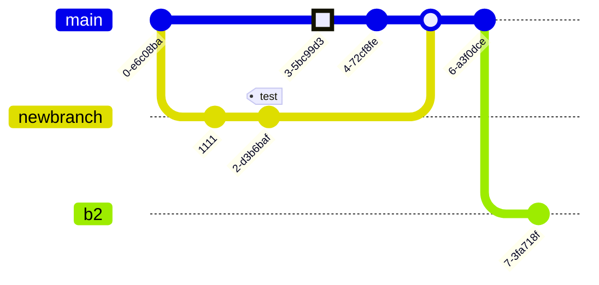
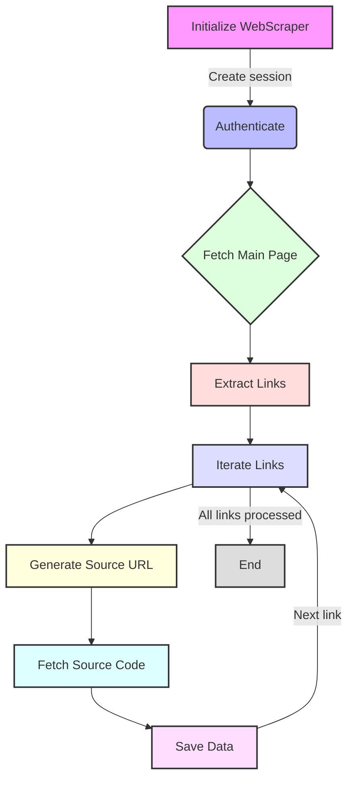
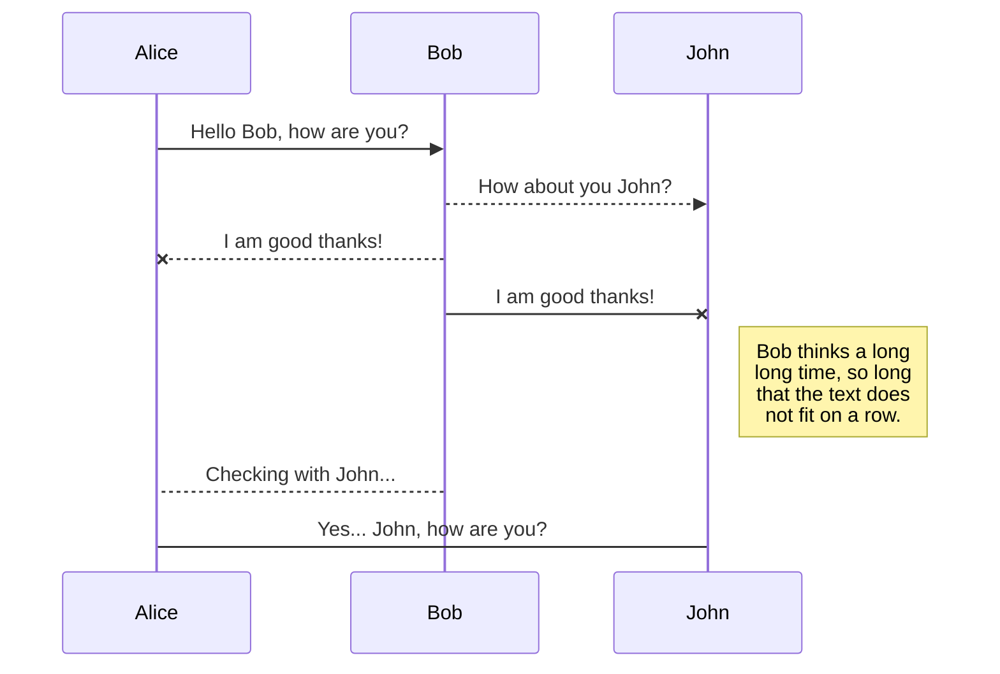

Sample mermaid.js diagrams from [here](https://mermaid.js.org/syntax/examples.html) 

```mermaid
gitGraph:
    commit "Ashish"
    branch newbranch
    checkout newbranch
    commit id:"1111"
    commit tag:"test"
    checkout main
    commit type: HIGHLIGHT
    commit
    merge newbranch
    commit
    branch b2
    commit
```

```mermaid
graph TD
    A[Initialize WebScraper] -->|Create session| B(Authenticate)
    B --> C{Fetch Main Page}
    C --> D[Extract Links]
    D --> E[Iterate Links]
    E --> F[Generate Source URL]
    F --> G[Fetch Source Code]
    G --> H[Save Data]
    H --> |Next link| E
    E --> |All links processed| I[End]

    style A fill:#f9f,stroke:#333,stroke-width:2px
    style B fill:#bbf,stroke:#333,stroke-width:2px
    style C fill:#dfd,stroke:#333,stroke-width:2px
    style D fill:#fdd,stroke:#333,stroke-width:2px
    style E fill:#ddf,stroke:#333,stroke-width:2px
    style F fill:#ffd,stroke:#333,stroke-width:2px
    style G fill:#dff,stroke:#333,stroke-width:2px
    style H fill:#fdf,stroke:#333,stroke-width:2px
    style I fill:#ddd,stroke:#333,stroke-width:2px
```

```mermaid
sequenceDiagram
    Alice ->> Bob: Hello Bob, how are you?
    Bob-->>John: How about you John?
    Bob--x Alice: I am good thanks!
    Bob-x John: I am good thanks!
    Note right of John: Bob thinks a long<br/>long time, so long<br/>that the text does<br/>not fit on a row.

    Bob-->Alice: Checking with John...
    Alice->John: Yes... John, how are you?

```

