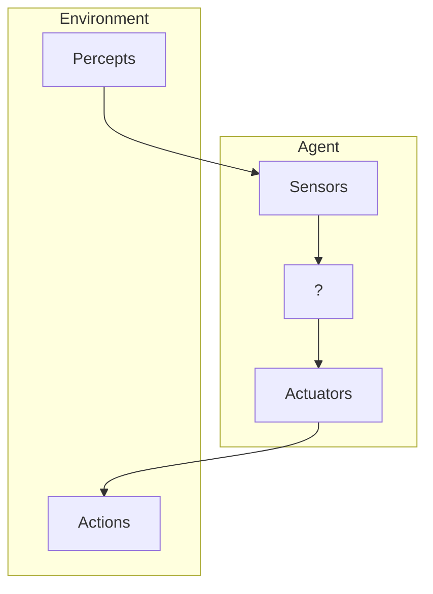

>[!info]- Source material
> - [[@Russell2021|S. Russell, P. Norvig (2021)]] - Chapter 2

| [[FAIKR#Contents|Next topic]] >>

---
## Agents and Environments

>[!def] **DEF** 
>An **agent** is anything that can be viewed as perceiving its environment through **sensors** and acting upon that environment through **actuators**. 

This simple idea is illustrated in the following [[FAIKR Intelligent Agents#^basic-agent-diagram|diagram]].

![[basic-agent-diagram.png]]
^basic-agent-diagram
## Rationality

## The nature of Environments

## The structure of Agents

---
- [[|Course page]]
- [[FAIKR#Course contents|Table of Contents]]

