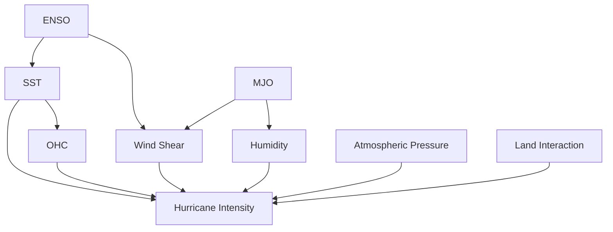
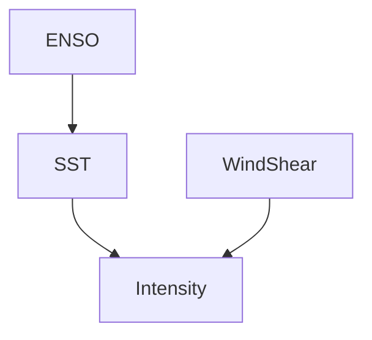
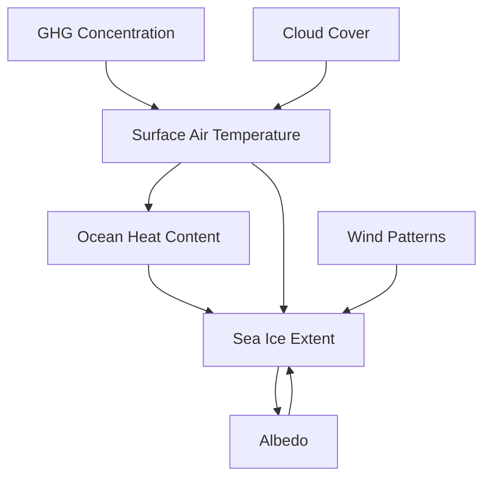

## Bayesian network to assess the impact of several factors on hurricane formation

The intensification of hurricanes is driven by a combination of factors. Some key variables to include in your Bayesian Network could be:

- **Sea Surface Temperature (SST)**: Warmer sea surface temperatures provide more energy for hurricanes to strengthen.
- **Atmospheric Pressure**: Lower pressure systems facilitate hurricane formation and intensification.
- **Wind Shear**: Changes in wind speed and direction with altitude (vertical wind shear) can inhibit or enhance hurricane intensity.
- **Humidity**: High levels of atmospheric moisture (especially in the lower atmosphere) can fuel storm growth.
- **Ocean Heat Content (OHC)**: The amount of heat stored in the upper layers of the ocean plays a key role in storm intensification.
- **Pre-existing Weather Patterns**: Large-scale phenomena like the **Madden-Julian Oscillation (MJO)** or **El Niño Southern Oscillation (ENSO)** can affect hurricane activity.
- **Land Interaction**: Proximity to land can weaken hurricanes, while warm waters near coasts may lead to rapid intensification.
- **Dust from the Sahara**: The Saharan Air Layer can suppress hurricane development by injecting dry air into the atmosphere.

### Structure of the Bayesian Network

A simplified network could have **Sea Surface Temperature (SST)**, **Wind Shear**, and **Ocean Heat Content (OHC)** as parent nodes directly affecting hurricane intensification. **ENSO** and **MJO** could serve as influential external factors that indirectly affect these conditions. Here’s a basic structure:

- **ENSO** (El Niño/La Niña) influences both **SST** and **Wind Shear**. El Niño often leads to increased wind shear, reducing hurricane formation, while La Niña typically decreases wind shear, promoting intensification.
- **MJO** (Madden-Julian Oscillation) impacts **Humidity** and **Wind Shear**. Certain MJO phases can enhance storm development by increasing atmospheric moisture and lowering wind shear.
- **SST** (Sea Surface Temperature) affects both **Ocean Heat Content (OHC)** and **Hurricane Intensity**, as warmer sea surface waters provide more energy for storm intensification.
- **OHC**: The higher the ocean heat content, the more energy available to fuel storm growth, leading to greater intensity.
- **Wind Shear**: High wind shear disrupts storm structure and reduces intensity, while low wind shear allows for stronger storms.
- **Humidity**: High atmospheric moisture levels feed the hurricane’s growth.
- **Atmospheric Pressure**: Lower pressure systems aid hurricane formation and intensification.
- **Land Interaction**: When hurricanes make landfall, they usually weaken, but if they pass over warm waters near coastal regions, they may undergo rapid intensification.

Could be expanded/shrunk with more detailed connections depending on **data availability**.

### Data Collection

 Some useful datasets:

- **National Hurricane Center (NHC) Data**: Provides historical hurricane tracks and intensities.

- **NOAA Climate Data**: Includes sea surface temperatures, atmospheric pressure, wind data, and humidity.

- **ERA5 Reanalysis Data**: Contains high-resolution atmospheric and oceanic data.

- **HURDAT2 Dataset**: The Atlantic hurricane database offers information on all Atlantic tropical cyclones.

- **Global Tropical Cyclone Climate Data**: Provides datasets on tropical cyclones across the globe, which include intensification trends.

### Parameter Estimation

Once you define the network structure, you can estimate the conditional probability distributions (CPDs) for each node. You could use:
- **Maximum Likelihood Estimation (MLE)**: For fitting the model to historical hurricane data.
- **Bayesian Estimation**: Incorporating prior knowledge (e.g., from climate science literature) to estimate CPDs where data is sparse.

### Modeling Process

- **1. Data Preprocessing**: Clean and format the dataset, focusing on variables affecting hurricane intensification (e.g., SST, wind shear, pressure gradients).

- **2. Define Network Structure**: Using expert knowledge and literature, define the network structure and relationships between the variables.

- **3. Parameter Learning**: Use historical data on hurricane intensification to learn the CPDs for each node. You can employ algorithms like Expectation-Maximization (EM) or sampling-based Bayesian methods (e.g., Gibbs sampling) for this.

- **4. Inference**: Once the network is built and trained, use it to infer the likelihood of hurricane intensification under different scenarios (e.g., given warmer SSTs and low wind shear).

- **5. Validation**: Validate the network by comparing predicted intensifications with historical hurricane records.

### Example Scenario

Consider an El Niño event (ENSO), which is known to increase wind shear in the Atlantic, typically suppressing hurricane formation. Your Bayesian Network could assess how much the reduction in SST or the increase in wind shear during an El Niño event reduces the likelihood of hurricane intensification. Similarly, during La Niña conditions, the model could show how warmer SSTs and reduced wind shear increase the chance of hurricane intensification.

### Visualization

- Once your BN is built, visualize it to communicate how each factor (e.g., SST, wind shear) contributes to hurricane intensification. Graphical tools like pgmpy in Python can be used to visualize the structure of the Bayesian Network.

### Extensions  

- You can extend the model to include socio-economic impacts by linking hurricane intensification to potential damage, using variables like **coastal population density**, **urbanization**, and **preparedness level**.

  
This Bayesian Network approach can help you assess how different climate and environmental factors contribute to the risk of hurricane intensification, providing a powerful tool for both understanding and predicting future hurricane activity.

Domanda: 
- **Parameter learning:** Given a set of data samples and a DAG that captures the dependencies between the variables, estimate the (conditional) probability distributions of the individual variables.
- **Structure learning:** Given a set of data samples, estimate a DAG that captures the dependencies between the variables.

