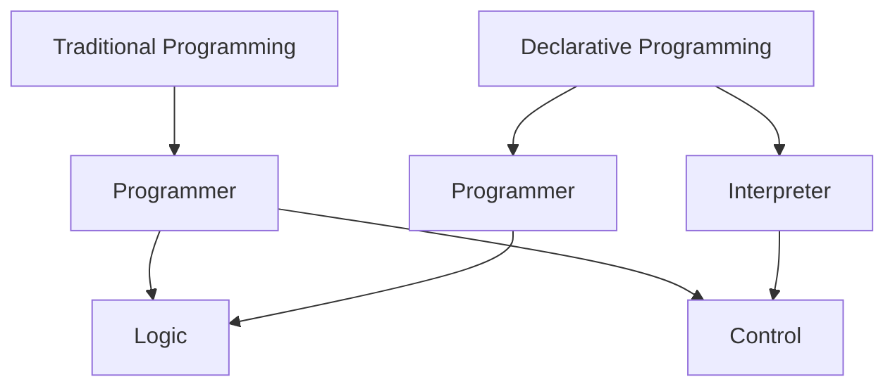
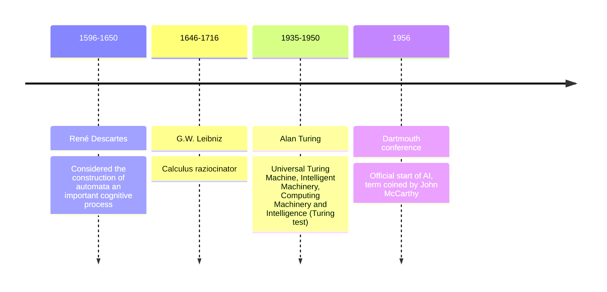
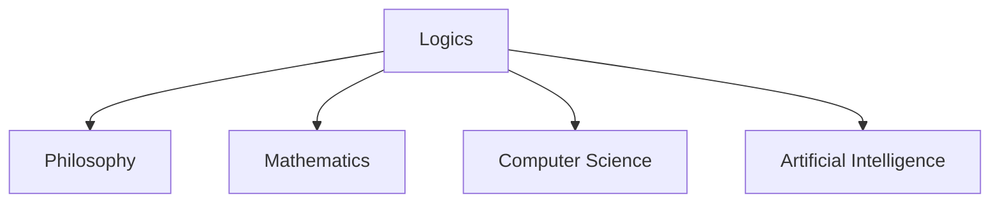

---


-  [[Symbolic AI]] and the need for [[logic]]
- Introduction to [[logic]]
    - [[Propositional logic]]
    - [[First Order Logic]] (FOL)
    - [[Resolution]]
    - [[Unification]]
- [[Logic programming]]
    - Procedural interpretation
    - Declarative interpretation
    - [[Prolog]] (1st part, 2nd part in another course)
- [[Constraint programming]]
    - [[CLP]]
    - [[MiniZinc]] (1st part, 2nd part in [[CDMO]] course)


## Motivational Examples

### Example 1: Combinatorial Problem

> [!example] Problem Statement
> Arrange three 1s, three 2s, ..., three 9s in sequence so that for all i∈[1,9] there are exactly i numbers between successive occurrences of i.

Solution: 1,9,1,2,1,8,2,4,6,2,7,9,4,5,8,6,3,4,7,5,3,9,6,8,3,5,7

Prolog program to solve this problem:

```prolog
sequence([_,_,_,_,_,_,_,_,_,_,_,_,_,_,_,_,_,_,_,_,_,_,_,_,_,_,_]).
% Sequence(X) -> X is a list of 27 variables

question(S):-
    sequence(S),
    sublist([9,_,_,_,_,_,_,_,_,_,9,_,_,_,_,_,_,_,_,_,9],S),
    sublist([8,_,_,_,_,_,_,_,_,8,_,_,_,_,_,_,_,_,8] ,S),
    sublist([7,_,_,_,_,_,_,_,7,_,_,_,_,_,_,_,7] ,S),
    sublist([6,_,_,_,_,_,_,6,_,_,_,_,_,_,6] ,S),
    sublist([5,_,_,_,_,_,5,_,_,_,_,_,5] ,S),
    sublist([4,_,_,_,_,4,_,_,_,_,4] ,S),
    sublist([3,_,_,_,3,_,_,_,3] ,S),
    sublist([2,_,_,2,_,_,2] ,S),
    sublist([1,_,1,_,1] ,S).

% S is a solution
```

### Example 2: Optimization Problem (Cakes)

> [!example] Problem Statement
> Determine how many banana and chocolate cakes to bake to maximize profit, given constraints on ingredients.

MiniZinc program to solve this problem:

```minizinc
% Baking cakes for the school fete
var 0..100: b; % no. of banana cakes
var 0..100: c; % no. of chocolate cakes

% flour
constraint 250*b + 200*c <= 4000;
% bananas
constraint 2*b <= 6;
% sugar
constraint 75*b + 150*c <= 2000;
% butter
constraint 100*b + 150*c <= 500;
% cocoa
constraint 75*c <= 500;

% maximize our profit
solve maximize 400*b + 450*c;

output [
"no. of banana cakes = \(b)\n",
"no. of chocolate cakes = \(c)\n"];
```

## Logic Programming

> [!quote] Bob Kowalski
> "Algorithm = Logic + Control"



### Declarative Programming

The task of the programmer is to specify the problem to be solved:
- Declare what we want to obtain, not how we achieve that

Three paradigms:
1. [[Logic Programming]] (Prolog ...)
2. [[Functional programming]] (ML, Haskell, OCaml ...)
3. [[Constraint Programming]] (MiniZinc, CLP, ILOG, ...)

## Logic

### Many Different Logics

- [[Classical logic]] (propositional, FOL ...)
- [[Intuitionistic logic]]
- [[Linear logic]]
- [[Epistemic logic]]
- [[Temporal logic]]

### Uses in Computer Science and AI

| Logic Type | Application |
|------------|-------------|
| Classical logic | AI, Logic Languages, specification and verification of software |
| Intuitionistic logic | Construction of software correct by design |
| Linear logic | Resources control |
| Epistemic logic | Security |
| Temporal logic | Specification and verification of software |

### Why Study Logic in Computer Science

1. Computer Science derives from Logic
2. Foundation of computation and declarative programming languages
3. Foundation of theoretical computer science (computability)
4. Proving correctness of software
5. Logic as a paradox-free language

## Artificial Intelligence

### Brief History



### Four Main Views of AI

1. Systems that think like humans
2. Systems that act like humans
3. Systems that think rationally
4. Systems that act rationally

### Two Main AI Categories

1. [[Symbolic computation]] (expert systems)
   - Logic-based reasoning
   - Can provide explanations for decisions
   - Not appropriate for problems such as image recognition

2. [[Subsymbolic computation]] (connectionist)
   - Based on artificial neural networks and machine learning
   - Very good for image recognition and problems that can't be solved algorithmically
   - Cannot provide explanations for decisions

# Logic and its Relation to AI

## Logic in Wikipedia

> [!quote] Definition
> Logic (from the ancient Greek λογική) is the systematic study of the form of valid inference, and the most general laws of truth. A valid inference is one where there is a specific relation of logical support between the assumptions of the inference and its conclusion.

Key points:
- No universal agreement on the exact scope and subject matter of logic
- Traditionally includes:
  - Classification of arguments
  - Systematic exposition of the 'logical form' common to all valid arguments
  - Study of proof and inference, including paradoxes and fallacies
  - Study of syntax and semantics

> [!note] Historical Context
> Logic has been studied in:
> - Philosophy (since ancient times)
> - Mathematics (since the mid-19th century)
> - Cognitive science (recently, encompassing computer science, linguistics, philosophy, and psychology)

## Many Different Logics

1. [[Classical logic]] (propositional, FOL ...)
   - Considers truth and inference
   - Example: If X and Y are true, can I deduce that W is also true?

2. [[Intuitionistic logic]]
   - Considers constructive proofs
   - Example: If I can construct a proof for X and for Y, can I construct a proof for W?

3. [[Linear logic]]
   - Considers resources
   - Example: If I have X and Y, can I exchange them for W?

4. [[Epistemic logic]]
   - Considers knowledge and belief
   - Example: If I believe that you know X and Y, can I conclude that I believe W?

5. [[Temporal logic]]
   - Considers evolution in time
   - Example: If X and Y will happen, can I conclude that W could happen?

## Uses in Computer Science and AI

| Logic Type | Application in CS/AI |
|------------|----------------------|
| Classical logic | AI, Logic Languages, specification and verification of software |
| Intuitionistic logic | Construction of software correct by design |
| Linear logic | Resources control |
| Epistemic logic | Security |
| Temporal logic | Specification and verification of software |

## Logics as an Interdisciplinary Subject



> [!info] Mathematical Logic
> Mathematical Logic = Application of mathematics methodology to the study of logic
> 
> But also: logic as the foundation of mathematics
> (different logics => different mathematics)

## Why Study Logic in Computer Science

1. **Computer Science derives from Logic**
   - Ancient mathematics lacked a strict formal basis (except geometry)
   - Logical derivation identified with a computation process
   - Study of computation processes led to surprising results:
     - Existence of non-computable functions
     - Class of computable functions definable in many different ways

2. **Foundation of computation and declarative programming languages**
   - Functional languages (LISP, ML, Haskell, OCAML, etc.)
     - Based on (composition of) functions
     - Strong relations with logic: programming corresponds to proving
   - Logic Languages (Prolog, CLP, CHR, CCP ...)
     - Based on the notion of relation
     - Computation = deduction
   - Constraint Languages (CLP, CHR, CCP, Minzinc, ...)
     - Based on relations and specific domain solvers

3. **Foundation of theoretical computer science (computability)**
   - Study of the limits of human knowledge
   - Not everything can be proved to be true or false
   - Not everything can be calculated

4. **Proving correctness of software**
   > [!warning] Fundamental Result
   > Most properties of programs are not decidable
   
   Approach: Given a program and a specification, use logic to prove that the program satisfies the specification.

5. **Logic as a paradox-free language**
   - Natural language allows paradoxes, hence not appropriate as a basis for mathematics or CS
   - Logic provides languages that are paradox-free

## Paradoxes

### False Paradox
> [!example] Find the error:
> x=1 => x² =x => x² -1= x-1 => (x -1)(x+1) = x-1 => x +1= 1 => x = 0

### Natural Language Paradoxes
1. The Liar's Paradox
   ```
   I am a liar
   I am liar iff what I am saying is not true
   I am liar iff "I am a liar" is not true
   ```

2. Definability Paradox
   ```
   Definition: Let x be the smallest number which cannot be defined with less than 1000 words
   x is defined iff x is the smallest number which cannot be defined with less than 1000 words
   x is defined (with less than 1000 words) iff x is not defined (with less than 1000 words)
   ```

### Russell's Paradox in Mathematics
Let X = {Y | Y ∉ Y}
Then X ∈ X iff X ∉ X

> [!tip] Solution to Russell's Paradox
> {Y | Y ∉ Y} is not a set
> - Not allowed to use the notion of set in a meta-linguistic way
> - Sets can be constructed only by selecting elements from sets

### Paradoxes in Computer Science

1. **Higher-order functions paradox**
   ```
   Define a function f(g) = not (g(g))
   Then f(f) = not (f(f))
   ```
   > [!note] Consequence
   > Functions computed by programs are not only total!

2. **Halting problem**
   ```
   Assume that a program f exists such that, given as input a program g and an argument x:
   f(g,x) = true iff g(x) terminates
   f(g,x) = false iff g(x) does not terminate

   Define h(g) = if f(g,g) = true then
                    while true do skip
                 else return 0

   Then h(h) terminates iff f(h,h) = false iff h(h) does not terminate
   ```
   > [!note] Consequence
   > Termination is not decidable!

3. **Cardinality paradox**
   ```
   Consider the set T of all possible values of a programming language.
   T contains at least booleans and functions.
   Assume also that a function in our programming language is a mathematical function. Then
   T = {0,1} ∪ T^T
   Absurd: |T| < 2 + |T^T|
   ```
   > [!note] Consequence
   > Any programming language cannot express all mathematical functions!

## Curry's Paradox

> [!example] The Paradox
> "If this sentence is true, then Santa Claus exists"

Call the above sentence A and "then Santa Claus exists" B

To "prove" that A is true:
1. Assume that the premise of A is true, that is "this sentence is true" is true. We must prove that B is true.
2. Assuming that the premise of A is true, means to assume that A->B is true and then, by modus ponens, B is true.
3. Hence A is true.
4. Since A is true, and A is the premise in the implication, B is true.

> [!tip] Resolution
> In many logics, if B is false, the statement in step 1 is not possible!

## Why Study Logic in AI

1. A tool for expressing human reasoning
2. Foundation of a classic approach to AI
3. Foundation of (declarative) languages used in AI
4. Direct application in some programming languages used in AI (e.g., PROLOG and CLP)