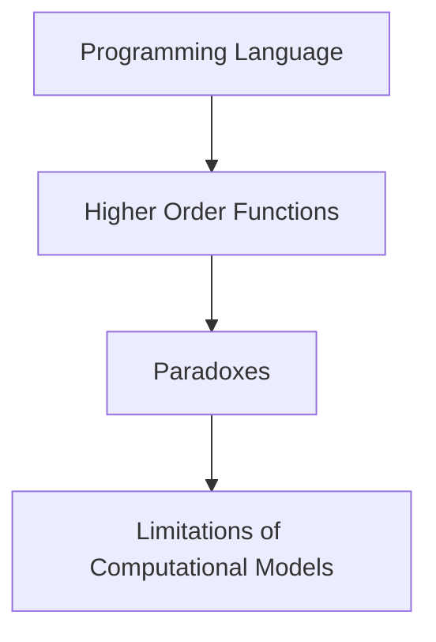
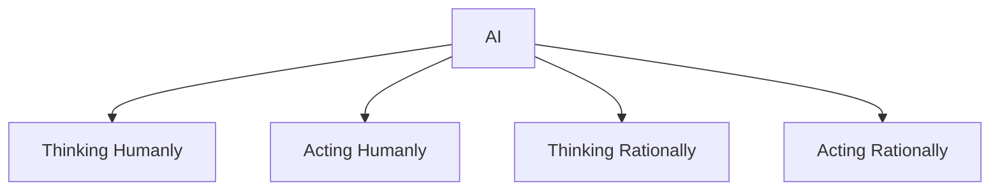
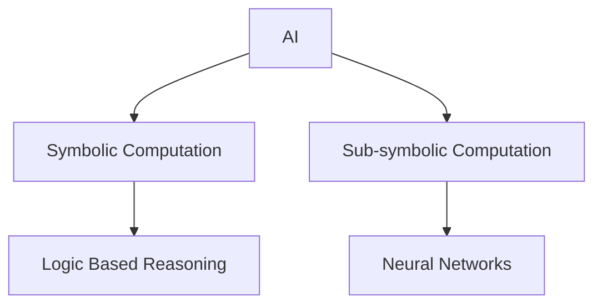

Sure! Here are the Obsidian-readable notes with callouts and mermaid.js for diagrams:

---

## Introduction to AI

> [!info] Course Details
> - **Instructor**: Maurizio Gabbrielli
> - **Department**: DISI, Università di Bologna
> - **Focus**: Languages and Algorithms for AI

> [!tip] Credits
> - Russell Norvig (AI book)
> - Claudio Sacerdoti Cohen (Logic course at CS, UniBo)
> - Dirk van Dalen (book “Logic and structure”)
> - E. Clarke (slides)

> [!info] Organization
> - **1st module**: This course
> - **2nd module**: Zavattaro
> - **3rd module**: Dal Lago
> - Different exams for each module (6 sessions a year)
> - Exam for this module: only written (online or in presence depending on the evolution of the emergency)

### Content for the 1st Module

> [!abstract] Topics Covered
> - Symbolic AI and the need for logic
> - Introduction to logic
> - Propositional logic
> - First-order logic (FOL)
> - Resolution
> - Unification
> - Logic programming
> - Procedural interpretation
> - Declarative interpretation
> - Prolog (1st part, 2nd part in another course)
> - Constraint programming
> - CLP
> - MiniZinc (1st part, 2nd part in another course)

### Reading Materials

> [!book] Recommended Reading
> - Handouts (These will be uploaded on Virtuale together with the slides and other material).
> - Dirk van Dalen. Logic and structure. 4th edition, Springer (available also online free).
> - Bratko. Prolog programming for artificial Intelligence. Available at: https://silp.iiita.ac.in/wp-content/uploads/PROLOG.pdf
> - Triska the power of Prolog. Available at: https://www.metalevel.at/prolog
> - Russell, Norvig. Artificial Intelligence: A Modern Approach (any edition). Pearson.
> - The MiniZinc Handbook. Available at: https://www.minizinc.org/doc-2.5.0/en/index.html

### Two Motivational Examples

> [!example] Example 1: A Combinatorial Problem
> **Problem**: Arrange three 1s, three 2s, … three 9s in sequence so that for all i∈[1,9] there are exactly i numbers between successive occurrences of i.
> **Solution**: `1, 9, 1, 2, 1, 8, 2, 4, 6, 2, 7, 9, 4, 5, 8, 6, 3, 4, 7, 5, 3, 9, 6, 8, 3, 5, 7`

> [!code] Prolog Program for Example 1
> ```prolog
> sequence([_,_,_,_,_,_,_,_,_,_,_,_,_,_,_,_,_,_,_,_,_,_,_,_,_,_,_]).
> 
> question(S):-   
>   sequence(S), 
>   sublist([9,_,_,_,_,_,_,_,_,_,9,_,_,_,_,_,_,_,_,_,9],S), 
>   sublist([8,_,_,_,_,_,_,_,_,8,_,_,_,_,_,_,_,_,8],S), 
>   sublist([7,_,_,_,_,_,_,_,7,_,_,_,_,_,_,_,7],S), 
>   sublist([6,_,_,_,_,_,_,6,_,_,_,_,_,_,6],S), 
>   sublist([5,_,_,_,_,_,5,_,_,_,_,_,5],S), 
>   sublist([4,_,_,_,_,4,_,_,_,_,4],S), 
>   sublist([3,_,_,_,3,_,_,_,3],S), 
>   sublist([2,_,_,2,_,_,2],S), 
>   sublist([1,_,1,_,1],S). 
> % S is a solution
> ```

> [!example] Example 2: Cakes Problem (A Simplified Production Planning Problem)
> **Problem**: Determine how many banana and chocolate cakes to bake for a school fete to maximize profit, given ingredient constraints and prices.
> 
> **MiniZinc Program**:
> ```minizinc
> var 0..100: b; % no. of banana cakes
> var 0..100: c; % no. of chocolate cakes
> 
> % flour
> constraint 250*b + 200*c <= 4000;
> % bananas
> constraint 2*b <= 6;
> % sugar
> constraint 75*b + 150*c <= 2000;
> % butter
> constraint 100*b + 150*c <= 500;
> % cocoa
> constraint 75*c <= 500;
> 
> % maximize our profit
> solve maximize 400*b + 450*c;
> 
> output ["no. of banana cakes = \(b)\n", "no. of chocolate cakes = \(c)\n"];
> ```

### Logic Programming

> [!quote] Bob Kowalski
> "Algorithm = Logic + Control"

> [!summary] Declarative Programming
> - The task of the programmer is to specify the problem to be solved: we have to "declare" what we want to obtain, and not how we achieve that.

> [!summary] Declarative Programming Paradigms
> 1. Logic Programming (Prolog)
> 2. Functional Programming (ML, Haskell, OCAML)
> 3. Constraint Programming (MinZinc, CLP, ILOG)

### Why Study Logic in Computer Science

> [!note] Key Reasons
> 1. Computer Science derives from Logic
> 2. Foundation of computation and of declarative programming languages
> 3. Foundation of theoretical computer science (computability)
> 4. Proving correctness of software
> 5. Logic as a language paradox free

### Paradoxes in Mathematics and Computer Science

> [!example] Paradox Example
> - **False Paradox**: `x=1  =>  x^2 = x  =>  x^2 -1 = x-1 => (x -1)(x+1) = x-1 => x +1 = 1 => x = 0`

> [!summary] Resolving Paradoxes
> - **How to solve Russell paradox**: `{Y | Y ∉  Y }` is not a set. Sets can only be constructed by selecting elements from sets.

> [!important] Paradoxes in Computer Science
> - Meta-linguistic features of programming languages and auto-application can lead to paradoxes, showing limitations of computational models.



> [!example] Cantor Diagonalization
> **Theorem**: Assume T contains at least two elements. Then | T | < | TT |.
> 
> **Proof**: 
> 1. Assume | T | = | TT |.
> 2. Define a function f(t) = t’ such that t’ ≠ g(t)(t).
> 3. This means g is not a bijection.

### AI Ante Litteram

> [!history] Early AI Influences
> - **René Descartes** (1596-1650): Investigated the connection between mind and body influenced by automatons.
> - **G.W. Leibniz** (1646-1716): Calculus Ratiocinator.
> - **Jacques de Vaucanson** (1709-1782): Built an artificial duck.
> - **Pierre Jacquet-Droz** (1721–1790): Designed animated dolls and automata.

### AI Before the Term Was Coined

> [!milestone] Key Developments
> - **1935**: Universal Turing Machine by Alan Turing.
> - **1947**: Alan Turing's talk on learning from experience.
> - **1948**: "Intelligent Machinery" by Turing.
> - **1950**: "Computing Machinery and Intelligence" by Turing.

### AI Today

> [!question] What is AI?
> - Systems that think like humans
> - Systems that think rationally
> - Systems that act like humans
> - Systems that act rationally

> [!summary] Four Definitions of AI (Russell and Norvig)
> 1. Thinking Humanly
> 2. Acting Humanly
> 3. Thinking Rationally
> 4. Acting Rationally



### Symbolic and Sub-symbolic AI

> [!info] Symbolic Computation
> - Logic-based reasoning
> - Can provide explanations for decisions
> - Not appropriate for problems such as image recognition

> [!info] Sub-symbolic Computation
> - Based on neural networks and machine learning
> - Good for image recognition and problems not solvable algorithmically
> - Cannot provide explanations for decisions



---