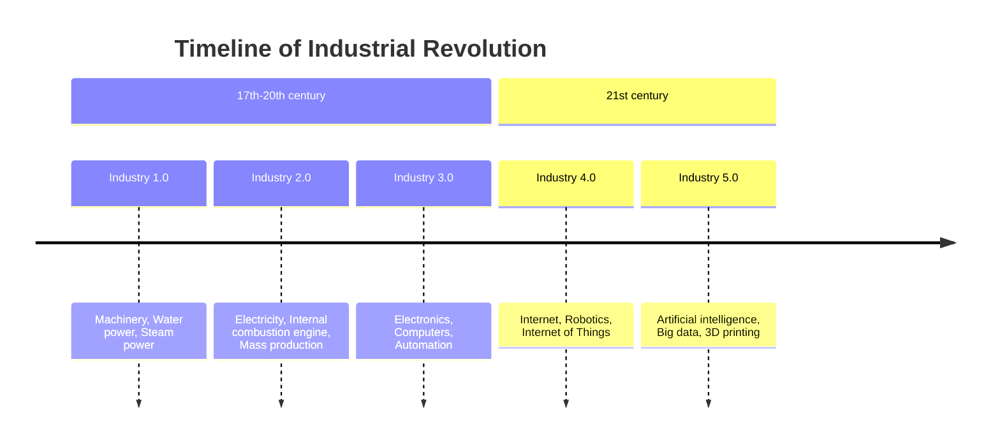

# Previous Exam Questions

## Written Test, Dec 16, 2022

1. **Describe and discuss the climate system, its components, and its feedbacks.**  
   (10 points)
2. **Describe and discuss the equations that govern the evolution of the Earth's climate system.**  (10 points)
3. **Describe and discuss the major numerical methods for the construction of Earth system models.**  (10 points)
4. **Describe and discuss the theory of the general circulation of the atmosphere.** (3 points)

## Written Test, Dec 18, 2023

Answer the following questions, using equations and schemes where appropriate:
1. **Primitive equations in General Circulation Models:**  Describe and discuss their properties. (25 points)
2. **Finite differencing and time differencing schemes:**  Explain and discuss two-level time differencing schemes. (25 points)
3. **Radiative-convective equilibrium models:** Describe and discuss. (25 points)
4. **GCM in future climate scenarios:**  Discuss their use.  (25 points)
5. **Optional question:**  Design a numerical experiment to investigate the effect of increasing deforestation in the tropical zone.  (20 points)  
   Note: You cannot answer this optional question unless the first four are completed.
   
---

## Oral Exam

- He tends to ask about topics and formulas in detail, but small inaccuracies are not heavily penalized.
- He can change subjects suddenly if he senses knowledge on a topic.
1. **Second question of the written test:**  
   Topics: Navier-Stokes components, thermodynamic equations, which terms are important, when and where, and how we use them in models.
2. **Climate system and energy sources:**  
   Asked about the principal source of energy (sun) and the one-layer radiation equilibrium.
3. **Numerical methods and models:**  
   Asked about finite derivatives, spectral transform methods, and predictions from modern models.

- Primitive equations (expected to be memorized)
- Geostrophic and hydrostatic balances
- Radiative equilibrium (fluxes)
- Finite differences method and CFL criterion
- General circulation (three cells)
- General circulation models (broad concepts and formulas)
- Advective equation, adiabatic and moist lapse rates
- Convective adjustment
- Ocean currents and energy balance
- Sigma and hybrid coordinates

### written test done
- **Chosen Topic:** Spherical coordinate system, Navier-Stokes equations, conservation of mass and energy, and equation of state.
- **Follow-up questions:** Approximations, numerical methods (finite differences, spectral method), effects of trace gas injection, and climate signature.
- **Chosen Topic:** Numerical methods (finite differences), consistency, accuracy, convergence, and stability of schemes.
- **Practical Example:** Von Neumann method for forward scheme and wave equation (du/dt = cu).
- **Follow-up questions:** Climate scenario simulations, radiative forcing, gas concentrations (CO₂, CH₄, N₂O).

### no written test
- **Chosen Topic:** Finite differences methods, stability from lambda and theta/w delta t, convection adjustment, and CFL condition calculations.
- **Follow-up questions:** Climate scenarios (RCP, SSP), predictability.
- **Chosen Topic:** Climate system components and temperature trends.
- **Follow-up questions:** Solar energy received and re-emitted (generic formulas), numerical methods.

