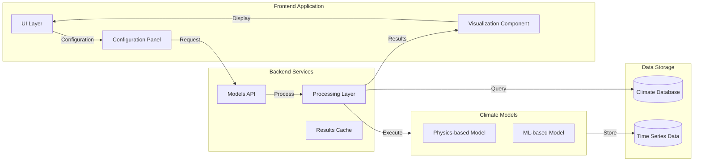

- Django + GraphQL Medium: https://medium.com/simform-engineering/empowering-your-django-backend-with-graphql-a-powerful-combination-764babd30bb0

```mermaid
flowchart LR
    subgraph Frontend["Frontend Application"]
        UI["UI Layer"]
        VIS["Visualization Component"]
        CONFIG["Configuration Panel"]
    end

    subgraph Backend["Backend Services"]
        API["Models API"]
        PROC["Processing Layer"]
        CACHE["Results Cache"]
    end

    subgraph Storage["Data Storage"]
        DB[(Climate Database)]
        TS[(Time Series Data)]
    end

    subgraph Models["Climate Models"]
        PHY["Physics-based Model"]
        ML["ML-based Model"]
    end

    UI --> |Configuration| CONFIG
    CONFIG --> |Request| API
    API --> |Process| PROC
    PROC --> |Query| DB
    PROC --> |Execute| Models
    Models --> |Store| TS
    PROC --> |Results| VIS
    VIS --> |Display| UI
```
